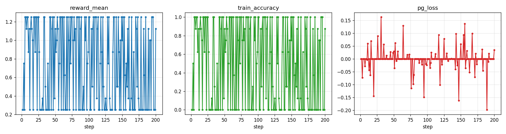

<h1 align="center">RadReason</h1>
<p align="center"><b>Incentivizing Medical Visual Diagnostic Reasoning in Vision-Language Models via Reinforcement Learning (GRPO)</b></p>

<p align="center">
  
  
  
  
</p>

---

## TL;DR

**RadReason** fine-tunes a vision-language model (**Qwen3-VL-4B-Instruct**) to *reason before it answers* on
medical visual question answering. Instead of supervised imitation, we use **Group Relative Policy Optimization
(GRPO)** with a **verifiable reward** (answer correctness + output format), so the model learns a
chain-of-thought (`<think>…</think>`) that improves diagnostic accuracy — with **no human-written rationales**.

The trainer is a **single-GPU, LoRA, no-vLLM / no-FSDP** implementation (rollouts via HuggingFace
`generate`), which runs on a single consumer/data-center GPU and on Windows.

> This repository is a clean, self-contained re-implementation inspired by the *R1-style* multimodal RL line of
> work (DeepSeek-R1 → VLM-R1 / MedVLM-R1). It is built for reproducibility and small-compute settings.

## Method

```
              ┌────────────────────────── GRPO training step ──────────────────────────┐
 image + Q ──▶ │  policy πθ (Qwen3-VL + LoRA) ──▶ sample G answers (HF generate, T>0)   │
              │        each answer:  <think> reasoning </think> <answer> a </answer>     │
              │  reward r = accuracy(a, gold)  +  format_bonus                           │
              │  advantage  Âᵢ = (rᵢ − mean(r)) / std(r)          (group-relative)        │
              │  loss  = − Σᵢ Âᵢ · meanₜ log πθ(tokenₜ)                                   │
              └──────────────────────────────────────────────────────────────────────────┘
```

- **Base model**: `Qwen3-VL-4B-Instruct` (frozen weights + LoRA adapters, ~0.1% trainable params).
- **Algorithm**: GRPO (critic-free; group-normalized advantages), rollouts by sampling `G` completions per prompt.
- **Reward**: verifiable — exact-match accuracy on closed-form medical VQA + a format bonus for well-formed
  `<think>/<answer>` structure. No reward model, no labeled reasoning traces.
- **Data**: public radiology VQA benchmarks — **VQA-RAD** and **SLAKE**. Training uses the closed-form
  (verifiable) questions of both train splits; evaluation is on the held-out test splits of each,
  reported separately.

## Key features

- ✅ **Verifiable-reward RL** on medical images — reasoning emerges from correctness pressure.
- ✅ **Single GPU · LoRA · no vLLM/DeepSpeed** — rollouts via `model.generate`; runs on Windows.
- ✅ **Reproducible** — public datasets, deterministic seeds, one-command train/eval.
- ✅ **Deployable** — FastAPI + Dockerfile serving the reasoning model as a `/diagnose` API.

## Results

*Closed-set exact-match accuracy on held-out test QA (greedy decoding, 400 samples per dataset), produced by `scripts/run_eval.bat`.*

| Model | VQA-RAD (closed) | SLAKE (closed) |
|---|---|---|
| Qwen3-VL-4B (zero-shot) | 51.01 | 50.41 |
| + GRPO, vanilla (200 steps) | 51.59 <sub>+0.58</sub> | 52.34 <sub>+1.93</sub> |
| + GRPO, **dynamic sampling** (200 steps) | **52.45** <sub>+1.44</sub> | **55.37** <sub>+4.96</sub> |

### Why the vanilla run barely moved

Logging per-step gradient norms exposed the bottleneck: **137 of 200 vanilla steps had zero
within-group reward variance** — all `G=8` rollouts for that prompt were equally right or equally
wrong, so every advantage `Âᵢ = (rᵢ − mean(r))/std(r)` collapsed to zero and the step contributed
no gradient. Train-time accuracy actually *drifted down* (0.53 → 0.39) as the useful signal thinned out.

Adding **DAPO-style dynamic sampling** (`--dynamic-sampling`: resample a prompt whose group has zero
reward variance, up to `--max-prompt-tries`) fixed it:

| | vanilla | dynamic sampling |
|---|---|---|
| zero-gradient steps | **137 / 200** | **25 / 200** |
| train accuracy (first 50 → last 50 steps) | 0.53 → 0.39 | 0.56 → 0.57 |
| mean reward (first 50 → last 50) | 0.78 → 0.64 | 0.80 → 0.79 |
| prompt groups discarded as uninformative | 0 | 439 |

Same compute budget, same reward function — the only change is *which prompts get to contribute a
gradient*, and it turns a +0.6 pp result into +5.0 pp on SLAKE.

<p align="center"><br>
<i>GRPO training: mean group reward, train-time accuracy, and policy-gradient loss over 200 steps.</i></p>

Per-run reports are in `results/*.json`; qualitative reasoning samples in `results/samples_*.md`.

## Installation

```bash
# tested with: Python 3.10, torch 2.6 (cu124), transformers 4.57, peft 0.19, datasets 4.8
pip install -r requirements.txt
export HF_ENDPOINT=https://hf-mirror.com   # optional: HF mirror for restricted networks
```

## 1) Prepare data

```bash
python scripts/prepare_data.py --datasets vqa-rad slake --out data
```
Downloads the datasets (via HF), unifies them to `{image, question, answer}`, tags each QA as
`closed`/`open`, and writes `data/{train,test}.jsonl` + `data/images/`.

## 2) Train with GRPO

```bash
python -m src.radreason.grpo_train --data data/train.jsonl --model <path/to/Qwen3-VL-4B-Instruct> \
       --out outputs/grpo --steps 300 --group 8 --lr 2e-5
```
Saves the LoRA adapter to `outputs/grpo/lora_adapter`, training curves and `metrics.json`.

## 3) Evaluate (zero-shot vs GRPO)

```bash
python -m src.radreason.eval --data data/test.jsonl --model <path> --out results/base.json          # zero-shot
python -m src.radreason.eval --data data/test.jsonl --model <path> --adapter outputs/grpo/lora_adapter --out results/grpo.json
```

## 4) Deploy

```bash
docker build -t radreason deploy/
docker run --gpus all -p 8000:8000 -e MODEL=/models/Qwen3-VL-4B-Instruct -e ADAPTER=/adapter radreason
# POST an image + question to http://localhost:8000/diagnose
```

## Repository structure

```
RadReason/
├── src/radreason/       # library: data, prompts, rewards, modeling, grpo_train, eval
├── scripts/             # prepare_data / run_grpo / run_eval launchers
├── deploy/              # FastAPI app + Dockerfile
├── configs/             # default hyper-parameters
├── docs/METHOD.md       # method write-up
└── results/ · outputs/  # eval reports · training artifacts (gitignored)
```

## Acknowledgements

- **Qwen3-VL** (Alibaba) — base vision-language model.
- **GRPO** (DeepSeek-R1) and the multimodal R1 line — **VLM-R1**, **MedVLM-R1** — for the recipe this work re-implements.
- **SLAKE** and **VQA-RAD** — public medical VQA benchmarks used for training and evaluation.

## Citation

```bibtex
@misc{radreason,
  title  = {RadReason: Incentivizing Medical Visual Diagnostic Reasoning via GRPO},
  author = {Zhu, Xiaoqian},
  year   = {2026},
  howpublished = {\url{https://github.com/<your-username>/RadReason}}
}
```

## License

Apache-2.0. Datasets and the base model are subject to their own licenses.
